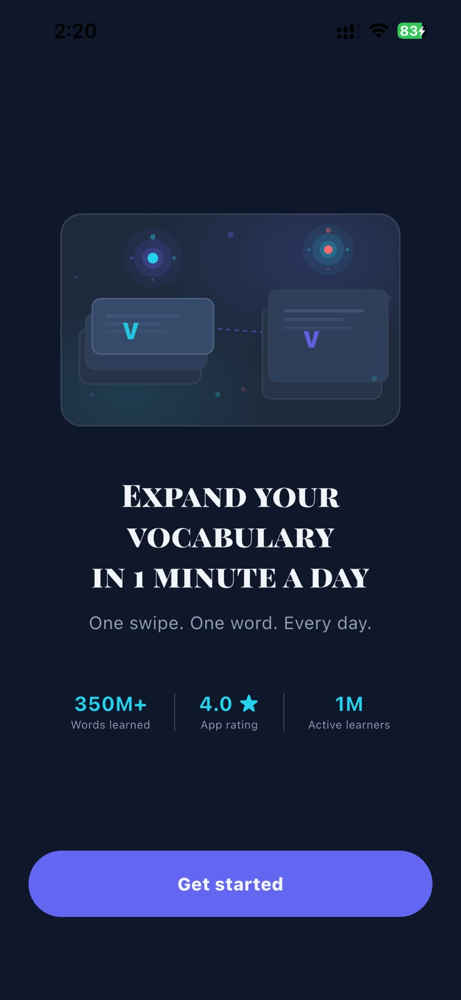
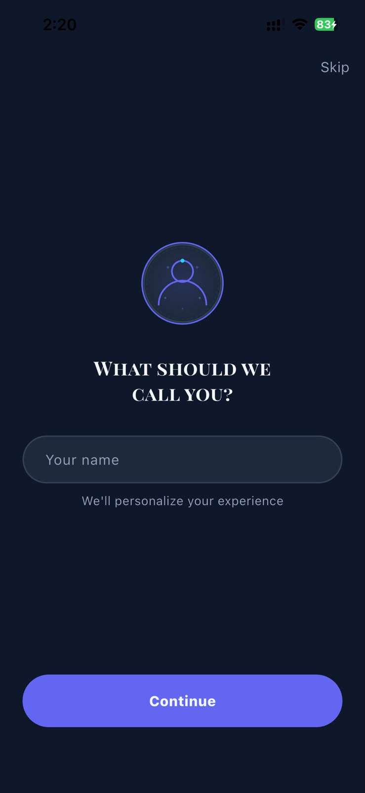
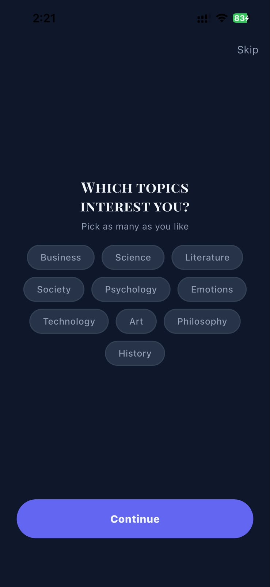
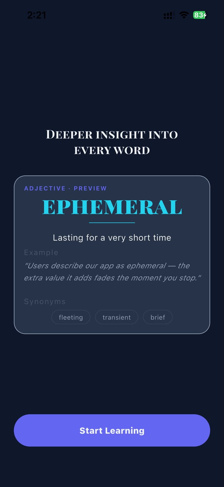
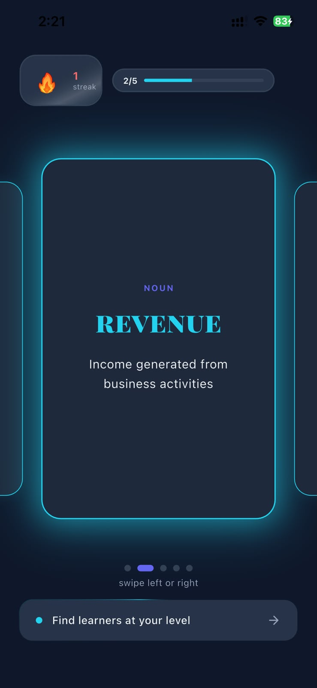
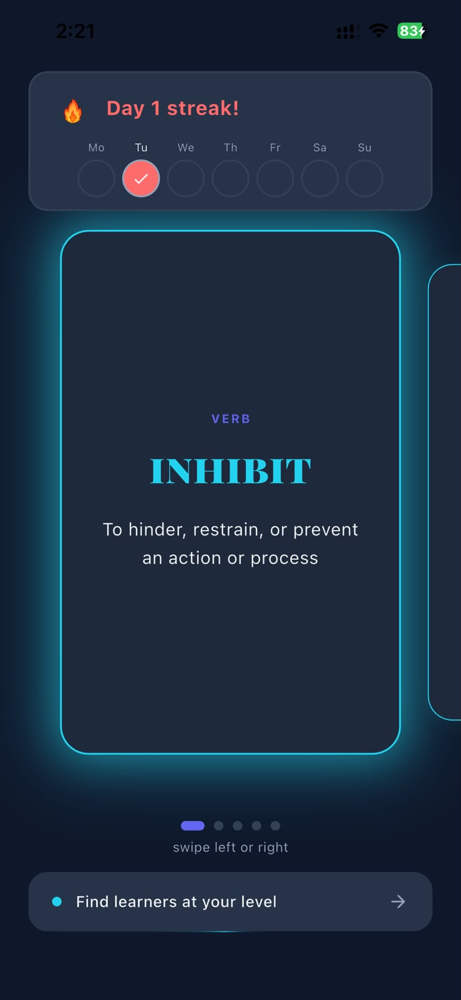
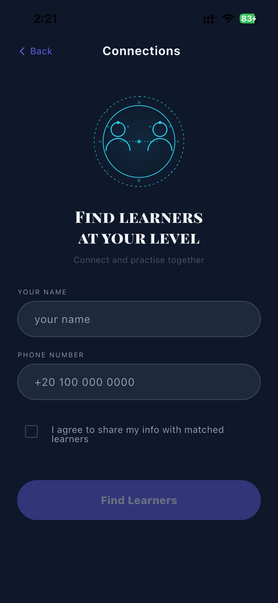
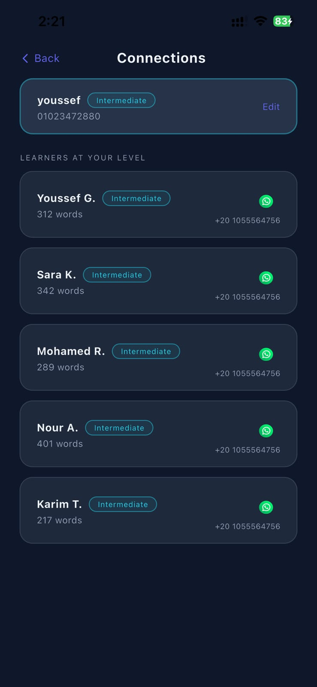

# Vocabulary — Flutter App

A clean, animated vocabulary-learning app built with Flutter. Learn 5 new words every day through a swipeable card deck, track your streak, and connect with other learners at your level.

---

## App Description

Vocabulary rebuilds the core experience of the original Vocabulary iOS/Android app as a Flutter MVP. The focus is on a fast, delightful learning loop: open the app, swipe through 5 curated words relevant to your chosen topics, and close. No noise, no subscriptions, no bottom navigation clutter.

---

## Features

### Onboarding
A 4-step flow that collects the user's name and topic preferences, with staggered animations and a skip option. Shown only once — subsequent launches go directly to the home screen.

### Home Screen
Daily swipeable word cards (5 per day, date-seeded from chosen topics). Includes a streak counter with Lottie flame animation, a progress badge, and a slide-down weekly progress toast on the first open of each day.

### Find Learners *(Personal Touch)*
A social discovery feature where users create a profile and browse other learners at their level with overlapping topic interests. Accessible from an animated gradient-border card on the home screen.

---

## Tech Stack

| Layer | Library | Version |
|---|---|---|
| UI scaling | `flutter_screenutil` | ^5.9.3 |
| SVG rendering | `flutter_svg` | ^2.3.0 |
| Lottie animations | `lottie` | ^3.3.1 |
| State management | `flutter_bloc` | ^9.1.1 |
| Equality helpers | `equatable` | ^2.0.7 |
| Local storage | `shared_preferences` | ^2.5.5 |
| HTTP client | `dio` | ^5.9.2 |
| Deep links / URLs | `url_launcher` | ^6.3.2 |

---

## Architecture

Feature-first folder structure. Each feature owns its own presentation layer (pages, widgets, cubits). Shared models and static data live in `features/shared`. Core utilities (routing, storage, theme) are framework-level concerns under `core/`.

State management follows the **BLoC / Cubit** pattern — UI reads state, cubits hold business logic, states are immutable `Equatable` classes.

Navigation is handled by a central `AppRouter` with named routes and a global `NavigationService` key, so cubits can navigate without a `BuildContext`.

---

## Project Structure

```
lib/
├── core/
│   ├── routing/
│   ├── storage/
│   ├── theme/
│   └── utils/
│
├── features/
│   ├── findLearners/
│   ├── home/
│   ├── onBoarding/
│   └── shared/
│
└── main.dart
```

---

## Screens & Navigation Flow

```
Launch
  │
  ├─ First time ──► OnboardingPage (4 steps) ──► HomePage
  │
  └─ Returning ───► HomePage
                        │
                        ├─► FindLearnersPage   (no profile saved yet)
                        └─► ConnectionsPage    (profile already saved)
```

---

## Demo Video

> iOS screen recording of the full app flow — onboarding, home screen, and Find Learners.

[▶ Watch Demo (Vocabulary.mp4)](screenshots/Vocabulary.mp4)

---

## Screenshots

### Onboarding

<p float="left">
  
  
  
  
</p>

### Home

<p float="left">
  
  
</p>

### Find Learners & Connections

<p float="left">
  
  
</p>

---

## Getting Started

### Prerequisites
- Flutter SDK `^3.12.2`
- Dart SDK `^3.12.2`
- Xcode (for iOS builds) or Android Studio / SDK (for Android builds)

